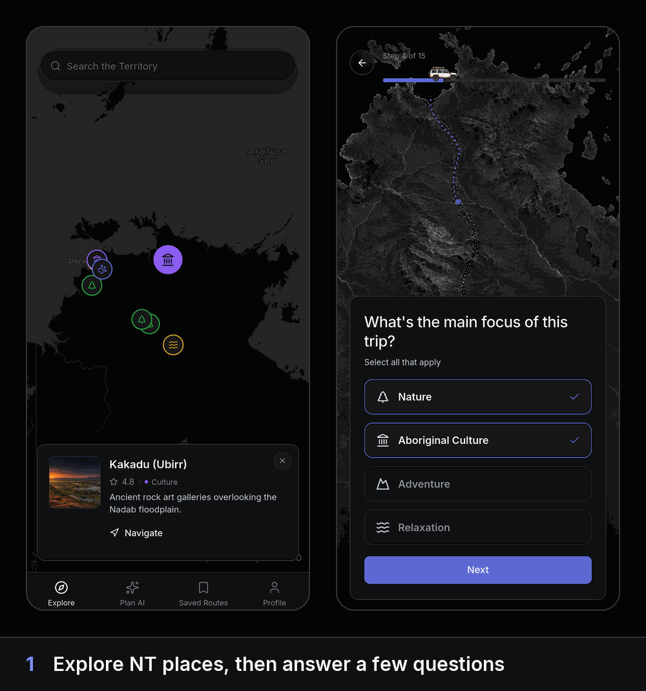
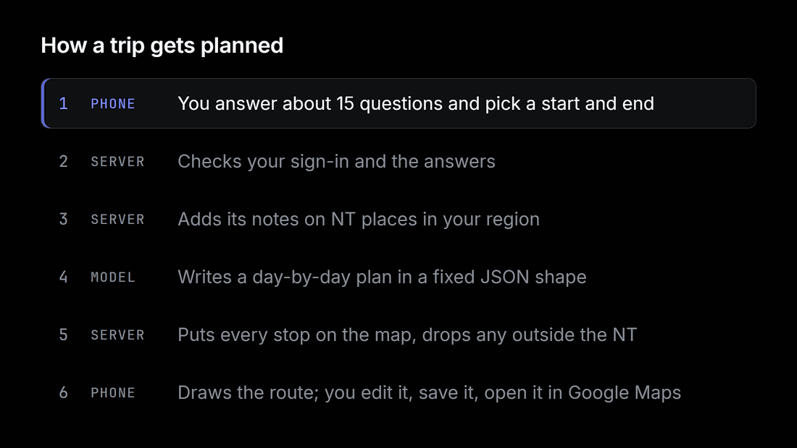

# Terra NT

[](https://github.com/Estaed/Terra-NT/actions/workflows/ci.yml)


[](LICENSE)

**A phone app that plans a road trip through Australia's Northern Territory from a few questions, then lets you reshape it and drive it in Google Maps.**

<p align="center">
  
</p>

Say you have a week, a campervan and no idea whether Litchfield comes before Kakadu. A list of
places does not help much: distances in the NT are huge, heat and wet-season closures decide
what is open, and long stretches have no phone signal. Terra NT asks how you travel, then
hands back an ordered, paced route on a map.

- **What it does:** turns about 15 answers into a day-by-day route with times, drive legs and a reason for every stop.
- **Why you can trust it:** every stop is checked against a map, and a stop that lands outside the NT is dropped before you see it.
- **Who decides:** you. Reorder, delete or skip stops, then export the route to Google Maps.

Built for PRT691 AI Practice at Charles Darwin University (2026) as part of a group project.
This repository holds the Flutter app and its planning server. The place photos are
generated artwork bundled with the app. [MIT licence](LICENSE).

## Quick start

**Just want to try it?** Install the [demo APK](https://github.com/Estaed/Terra-NT/releases/latest)
on an Android phone. It has no planning server, so *Plan AI* shows one built-in demo trip.

To build it yourself, you need [Flutter](https://docs.flutter.dev/get-started/install) 3.47 (Dart 3.13) and an
Android emulator or phone.

```sh
cd terra_nt
cp .env.example .env        # add a free CARTO key: https://carto.com/basemaps/apikey/
flutter pub get
flutter run --dart-define-from-file=.env
```

With `PLAN_API_URL` left empty the app plans from its built-in demo route, so it runs with no
server. Without a CARTO key the map still draws, stamped "API KEY REQUIRED".

To plan with the real server instead, start it and point the app at it (`10.0.2.2` is the
Android emulator's name for your computer):

```sh
python tools/plan_server/server.py --backend fixture --no-auth   # no model, no login
# terra_nt/.env:  PLAN_API_URL=http://10.0.2.2:8787
```

`--backend fixture` answers instantly with a saved four-stop plan. For a real plan, use
`--backend codex` (the Codex CLI, logged in; the one used day to day) or `--backend openrouter`
with `OPENROUTER_API_KEY` set (unit-tested, not yet run live); see [`tools/plan_server/README.md`](tools/plan_server/README.md).

## How it works

<picture>
  <source media="(prefers-color-scheme: dark)" srcset="docs/img/how-it-works-dark.gif">
  <source media="(prefers-color-scheme: light)" srcset="docs/img/how-it-works-light.gif">
  
</picture>

1. **Questions.** The phone asks about trip length, company, vehicle, budget and region, plus
   NT-specific ones such as how you handle heat and whether you will go out of phone range.
2. **Check.** The planning server verifies the Firebase sign-in token and validates the answers.
3. **Place notes.** It adds short documents about real NT places for the chosen region to the
   prompt (plain text from `tools/plan_server/rag/`, no vector store).
4. **Plan.** The model returns a day-by-day plan that must match a fixed JSON schema.
5. **Map check.** Every stop gets coordinates, first from the place notes, then from
   OpenStreetMap. A stop outside the NT is dropped; fewer than two left is an error.
6. **Route.** The phone draws the stops on a CARTO dark map. You edit, save and export.

The full request and response format is in [`docs/PHASE-3-CONTRACT.md`](docs/PHASE-3-CONTRACT.md).

<details>
<summary><b>What the app does, screen by screen</b></summary>

- **Explore:** a map of NT places, each marked by its kind. Tap one for a short description,
  a rating and directions.
- **Plan AI:** the questions, with a car driving along a dotted road as the progress bar.
  Some questions appear only for certain answers, so the count changes as you go.
- **Loading:** the route is drawn while the plan is generated (about 25 seconds with the
  Codex backend).
- **Result:** numbered pins on the map and a sheet with *Highlights* or a *Detailed* timeline.
  *Edit Route* reorders and deletes stops; *Export to Google Maps* opens the directions.
- **Stop detail:** the day's schedule, opening hours, the next drive, a road-conditions link
  and the planner's reason for the stop. *Skip* takes a stop out of the route without deleting it.
- **Saved Routes:** saved on the phone and copied to your account in Firestore, readable only
  by you (`firestore.rules`).
- **Sign-in:** email and password or Google (Firebase Authentication).
- **Offline:** map areas you have opened stay available for up to 30 days, as CARTO's terms allow.

</details>

<details>
<summary><b>Project layout</b></summary>

| Path | What it is |
|---|---|
| `terra_nt/` | The Flutter app. `lib/features/` holds one folder per screen, `lib/data/` the models and repositories, `lib/core/theme/` every colour, size and motion token. |
| `tools/plan_server/` | The planning server (Python 3.13): token check, prompt, model backends, geocoding. |
| `tools/plan_stub/` | A tiny stand-in server that returns canned answers and errors, for app tests by hand. |
| `docs/PRD.md` | The original product spec. The running app has moved past it; it stays as history. |
| `docs/PHASE-3-CONTRACT.md` | The contract between the app and the planning server. |
| `docs/IOS-SETUP.md` | Building and running on an iPhone. |
| `design/` | The HTML prototype and design tokens the app was built from. |
| `firestore.rules` | Saved routes: each user reads and writes only their own. |

</details>

<details>
<summary><b>Running on a real phone</b></summary>

**Android with a USB cable:** turn on *Developer options → USB debugging*, plug the phone in,
then run `tools/plan_server/start.bat`. It links every connected phone and emulator to the
computer (`adb reverse`) and starts the server; keep the window open. Build with
`PLAN_API_URL=http://127.0.0.1:8787` in `.env`:

```sh
cd terra_nt
flutter build apk --release --dart-define-from-file=.env
adb install -r build/app/outputs/flutter-apk/app-release.apk
```

A phone plugged in later needs `tools/plan_server/link-devices.bat`.

**Without a cable (any phone, iPhone too):** expose the server with
`cloudflared tunnel --url http://localhost:8787` and put the `https://….trycloudflare.com`
address in `PLAN_API_URL`. Keep the token check on, since the tunnel is public.

**iPhone:** [`docs/IOS-SETUP.md`](docs/IOS-SETUP.md).

**Firebase:** the app is wired to the course's Firebase project (`terra-nt-cdu`). To use your
own, create a project and run `flutterfire configure` inside `terra_nt/`.

</details>

<details>
<summary><b>Checks</b></summary>

```sh
cd terra_nt
flutter analyze        # clean
flutter test           # 957 tests
cd ..
python -m unittest discover -s tools/plan_server -p "test_*.py"   # 27 tests, no network
```

</details>

## Built with

Flutter, Riverpod, flutter_map with CARTO dark tiles, Firebase (Authentication, Firestore,
Crashlytics), and a Python planning server. The fonts (Inter, JetBrains Mono) are bundled, so
nothing typographic needs a signal.
